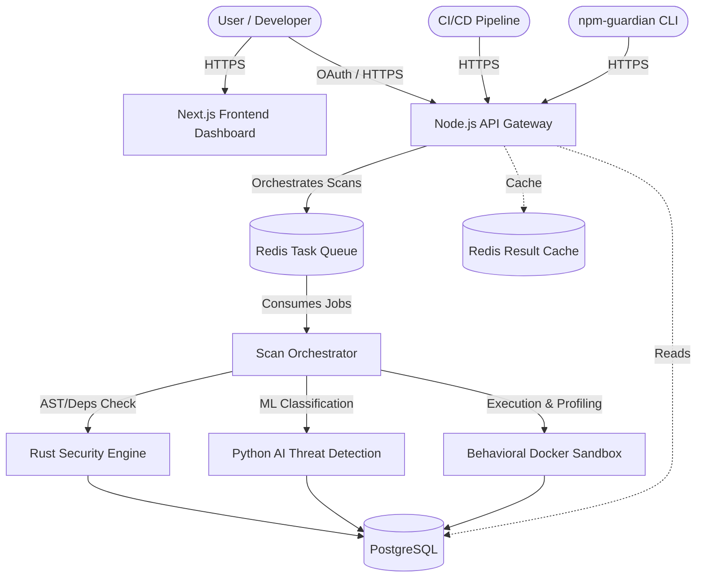

# npm-Guardian System Architecture

## 1. High-Level Overview

The npm-Guardian platform operates as a massive distributed system composed of several core microservices. It is built to securely analyze and classify npm packages, dependencies, and whole repositories for malicious behavior, specifically focusing on the Node.js ecosystem.

### System Flow

## 2. Core Microservices

### 2.1 Backend API Gateway
- **Language/Framework**: TypeScript, Node.js, Express/Fastify.
- **Role**: Entry point for all external requests (Frontend, CLI, CI/CD). Handles OAuth 2.0 (GitHub, GitLab, Bitbucket), JWT session management, RBAC, and enqueuing scan jobs to Redis.
- **Key Features**: Rate limiting, API key generation, threat-intelligence querying.

### 2.2 Security Engine (Static Analysis)
- **Language**: Rust.
- **Role**: Rapid, high-concurrency static code analysis and dependency resolution.
- **Key Responsibilities**:
  - Fetches packages from the npm registry.
  - Builds the dependency tree (`package-lock.json`, `yarn.lock`, etc).
  - Uses AST (Abstract Syntax Tree) parsing (e.g., SWC) to flag unsafe method calls (`eval`, `child_process.exec`, `spawn`).

### 2.3 AI Threat Detection Engine
- **Language/Libraries**: Python, PyTorch, scikit-learn, networkx, transformers.
- **Role**: Detects anomalous behavior, obfuscated code, and complex supply-chain attack vectors.
- **Key Responsibilities**:
  - Evaluates code entropy (detecting Base64/Hex encoding and string splitting).
  - Graph neural networks (GNNs) using `networkx` to find hidden threats deep in the dependency chain.
  - Generates the final weighted **Risk Score (0-100)**.

### 2.4 Behavioral Sandbox
- **Technology**: Docker, containerd, eBPF / Sysdig.
- **Role**: Safely executes suspicious packages in an ephemeral environment to monitor runtime behavior.
- **Key Responsibilities**:
  - Intercepts malicious postinstall scripts.
  - Monitors `execve` syscalls, unauthorized file writes (`~/.ssh`, `/etc/shadow`), and external network anomalies (C2 beaconing).
  - Completely wipes the environment after the scan.

### 2.5 Relational Storage & Caching
- **Primary Database**: PostgreSQL (Stores users, repositories, scan reports, vulnerability signatures).
- **Cache/Message Broker**: Redis (Caches package risk scores for immediate retrieval, processes asynchronous Celery/BullMQ tasks).

## 3. Data Privacy and Security
All repository source code cloned for scanning is stored on ephemeral, memory-backed volumes (`tmpfs`), and is strictly **deleted** upon completion of the scan pipeline. Persistent storage only holds metadata and generated risk scores.
