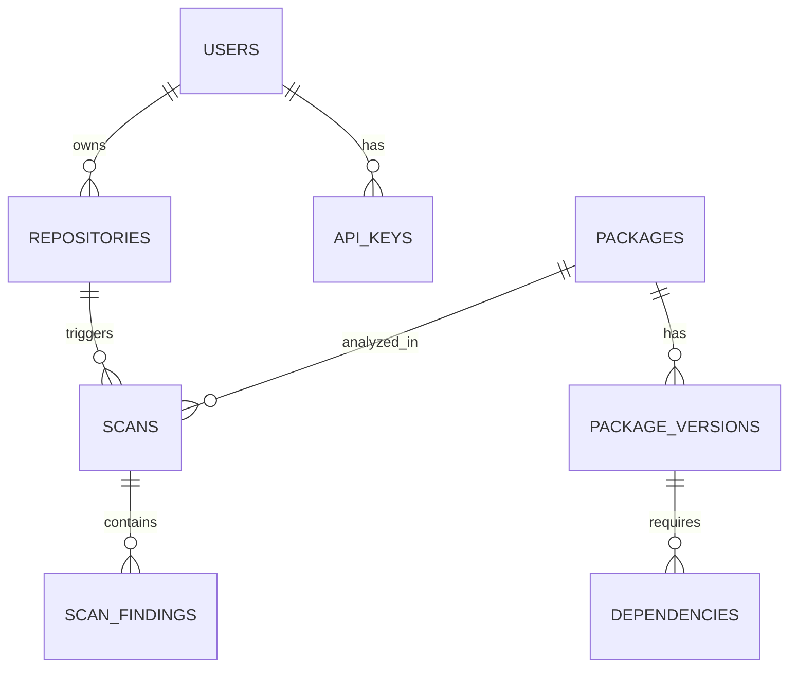

# npm-Guardian Database Schema

This document outlines the core database schema hosted on **Supabase** (managed PostgreSQL) optimized for high-throughput reads and scan report storage.

## Setup
1. Create a free project at [supabase.com](https://supabase.com)
2. Navigate to **SQL Editor → New Query**
3. Paste and run the contents of [`backend/supabase_schema.sql`](file:///c:/Users/DELL%20LATITUDE/OneDrive/Desktop/npm%20Detect/npm-guardian/backend/supabase_schema.sql)

## ER Diagram Overview

## Table Definitions

### `users`
Stores user accounts via OAuth.
- `id` (UUID) PK — auto-generated
- `email` (VARCHAR) UNIQUE
- `oauth_provider` (VARCHAR) ('github', 'gitlab', 'bitbucket')
- `oauth_id` (VARCHAR) UNIQUE
- `login` (VARCHAR)
- `avatar_url` (TEXT)
- `created_at` (TIMESTAMPTZ)
- `last_login` (TIMESTAMPTZ)

### `api_keys`
API tokens for CLI and CI/CD tools.
- `id` (UUID) PK
- `user_id` (UUID) FK -> users.id
- `hashed_key` (VARCHAR)
- `name` (VARCHAR)
- `expires_at` (TIMESTAMPTZ)

### `repositories`
Tracked repositories linked for scanning.
- `id` (UUID) PK
- `user_id` (UUID) FK -> users.id
- `repo_url` (VARCHAR)
- `provider` (VARCHAR)
- `branch` (VARCHAR)

### `packages`
Registry of npm packages analyzed by the platform.
- `id` (UUID) PK
- `name` (VARCHAR) UNIQUE
- `latest_scan_score` (INT) - 0 to 100
- `maintainer_reputation_score` (INT)

### `package_versions`
Specific versions of an npm package.
- `id` (UUID) PK
- `package_id` (UUID) FK -> packages.id
- `version` (VARCHAR)
- `tarball_url` (VARCHAR)
- `publish_date` (TIMESTAMPTZ)

### `scans`
Main record for a scan event (package or repository).
- `id` (UUID) PK
- `type` (ENUM) - ('package', 'repository')
- `repository_id` (UUID) FK -> repositories.id (Nullable)
- `package_name` (VARCHAR)
- `package_version` (VARCHAR)
- `status` (ENUM) - ('queued', 'running', 'completed', 'failed')
- `overall_risk_score` (INT)
- `risk_level` (VARCHAR)
- `started_at` (TIMESTAMPTZ)
- `completed_at` (TIMESTAMPTZ)

### `scan_findings`
Specific vulnerability patterns found during a scan.
- `id` (UUID) PK
- `scan_id` (UUID) FK -> scans.id
- `severity` (ENUM) - ('low', 'medium', 'high', 'critical')
- `category` (VARCHAR)
- `description` (TEXT)
- `file_path` (VARCHAR)
- `line_number` (INT) Nullable
- `payload_preview` (VARCHAR) Nullable

## Caching Strategy (Redis)
- **`cache:package_risk:{package_name}`**: Returns immediate integer score. TTL: 24 hours.
- **`queue:scan_jobs`**: List of incoming scan request UUIDs.
